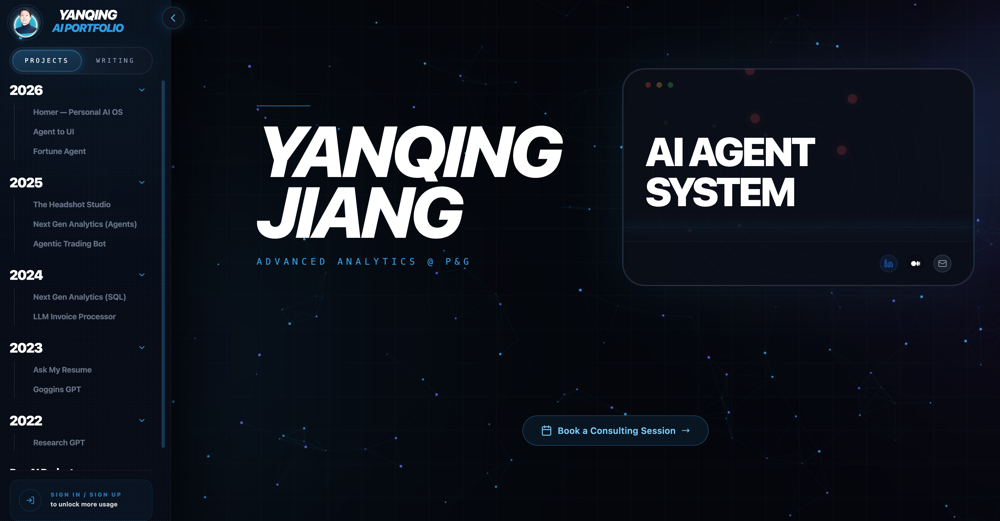
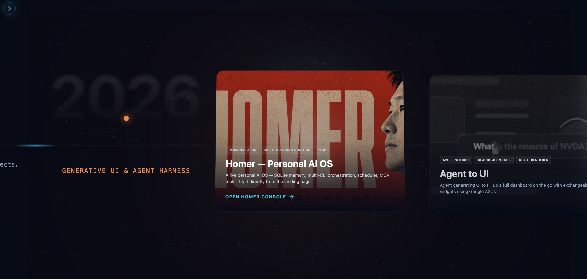

# AI Portfolio (Yanqing Jiang)

**🌐 Live site: [yanqing.app](https://yanqing.app)**

[](https://yanqing.app)

[](https://yanqing.app)

Interactive AI portfolio that combines a Vite-powered React frontend, a FastAPI backend, and multiple agentic workflows (analytics copilots, resume Q&A, LinkedIn headshot generator, and research assistants). The site prerenders static pages, streams live AI responses, and exposes JSON-LD/SEO metadata for every project.

> For deeper diagrams and sequence flows, see `ARCHITECTURE.md`, `docs/architecture-conversational-analytics.md`, `docs/linkedin-photo-*`, and `backend/analytics/ARCHITECTURE.md` (legacy).

## Repository Layout

```
.
├── App.tsx                  # Client router and layout wrapper
├── components/              # React feature modules (analytics, LinkedIn photo, chat, UI)
├── constants/               # Project catalog, SEO config, structured data builders
├── services/                # Frontend API clients (Gemini, REST, config)
├── backend/                 # FastAPI app, analytics suite, LinkedIn photo pipeline
├── docs/                    # Design notes, rate-limit plans, roadmap material
├── scripts/                 # Prerender output, demo clients, automation helpers
├── ssr/                     # Server-side rendering entry for Vite build
├── public/                  # Static assets served by Vite
└── tests/ / backend/tests/  # Frontend (vitest) and backend (pytest) harnesses
```

## Key Features

- **Agent showcase landing page** – Rich project grid, animations, and SEO tags (Open Graph, Twitter, JSON-LD) driven by `constants.ts` and `components/LandingPage.tsx`.
- **Next Gen Analytics (Agents)** – `/project/next-gen-analytics-agent` now runs on the Conversational Analytics backend (`/api/conv-analytics`) while retaining the original Next Gen naming and SEO; uses `components/conversationalAnalytics` for the chat UI.
- **Legacy analytics (archived)** – The former Next Gen Analytics agent UI is stored under `analytics-legacy/next-gen-analytics-agent`; SQL flows remain under `components/analytics/sql` for comparison.
- **LinkedIn Photo generator** – `/components/linkedinPhoto/Page.tsx` integrates the FastAPI `linkedin_photo` router to expand style prompts, call Gemini image editing, and manage user-facing transparency.
- **Resume & research agents** – Backend endpoints in `backend/resume_agent.py` and `backend/research_agent.py` answer targeted queries with streaming reasoning.
- **Structured SEO + prerendering** – `ProjectHelmet` and `constants/structuredData.ts` inject page-level metadata, while `scripts/prerender.mjs` prebuilds static HTML, sitemaps, and JSON assets.
- **Rate limiting & payments ready** – Redis-backed limiter (`backend/rate_limiter.py`) with Stripe/PayPal hooks for token packs; docs outline the future safeguard plan.

## Frontend Overview

- **Stack**: React 19 + TypeScript, Vite 6, Tailwind utilities (via `tailwind-merge`), Framer Motion animations, React Router 6.
- **Data & services**:
  - `services/apiService.ts` centralizes authenticated REST calls (JWT from Supabase).
  - `services/config.ts` exposes runtime backend URLs.
  - `services/backendGeminiService.ts` handles Gemini text streaming.
- **Feature modules**:
  - `components/conversationalAnalytics/**` for the primary analytics chat.
  - `components/analytics/**` for SQL demos and legacy comparisons (memory flow archived in `analytics-legacy/`).
  - `components/linkedinPhoto/**` for the 3-step headshot wizard.
  - `components/Chat.tsx` for shared agent chat UI.
  - `components/ProjectHelmet.tsx` for head/meta tags and schema injection.
- **Routing**: `App.tsx` mounts the landing page at `/` and project pages at `/project/:id`. SSR builds reuse `ssr/entry-server.tsx`.
- **SEO**: `constants/seo.ts` tracks canonical tags, sameAs profiles, default OG images, and AI crawler policies. Project-specific SEO lives in `constants.ts`.

## Backend Overview

- **FastAPI app** (`backend/main.py`):
  - Loads `.env`, configures CORS, registers routers for analytics, research, resume, text-to-speech, payments, and LinkedIn photo flows.
  - Streams Server-Sent Events for analytics workflows (progress, tool calls, reasoning traces).
  - Serves pre-render assets (`public/ai-projects.json`) and health endpoints.
- **Conversational analytics** (`backend/conversational_analytics/`):
  - Claude-driven agent and supervisor orchestration with SSE endpoints at `/api/conv-analytics`.
  - Skills, memory, and trading integrations live under `skills/`, `memory/`, and `tools/`.
  - See `docs/architecture-conversational-analytics.md` for diagrams and flow notes.
- **Analytics suite** (`backend/analytics/`, legacy):
  - `flows/workflow.py` orchestrates planner-executor, single-agent, and multi-agent pipelines.
  - SQL templates sourced from `backend/config/schemas/*.yaml`.
  - Uses LangGraph-inspired task graphs, ECharts-ready payloads, and telemetry for the frontend process panel.
- **LinkedIn photo pipeline** (`backend/linkedin_photo/`):
  - Validates uploads (Pillow), enforces prompt quotas, expands style instructions, and calls Gemini image editing via Banana-hosted Nano models.
  - `docs/linkedin-photo-rate-limit-plan.md` and `docs/linkedin-photo-next-steps.md` track rate-limit rollout and backlog.
- **Shared services**:
  - `gemini_service.py` – session manager for Gemini text agents.
  - `rate_limiter.py` – Redis + in-memory fallback for global/per-user quotas with scopes.
  - `analytics_agent.py` – legacy standalone orchestrator kept for compatibility.
  - `tts.py` – text-to-speech synthesis.
- **Integrations**: Supabase JWT validation, Stripe and PayPal tokens, optional external search APIs, Gemini SDK.

## Setup & Development

### Prerequisites
- Node.js 20+
- Python 3.11+
- PowerShell (scripts expect PS; adjust if using another shell)
- Optional: Redis for production-like rate limiting

### Frontend Setup
```powershell
# from repo root
npm install
Copy-Item .env.example .env        # supply VITE_* values if needed
npm run dev                        # dev server at http://localhost:5173
```

Environment keys (`.env`):
```
VITE_BACKEND_URL=http://localhost:8000
VITE_SUPABASE_URL=...
VITE_SUPABASE_ANON_KEY=...
```

### Backend Setup
```powershell
Set-Location backend
pip install -r requirements.txt
Copy-Item .env.example .env        # populate API keys and secrets
py -m uvicorn main:app --reload --port 8000
```

`backend/.env` expects (subset):
```
GEMINI_API_KEY=...
CLAUDE_API_KEY=...
DATABASE_URL=...
CONV_ANALYTICS_DEBUG=true
OPENAI_API_KEY=...
SUPABASE_JWT_SECRET=...
REDIS_URL=redis://localhost:6379/0
STRIPE_SECRET_KEY=...
PAYPAL_CLIENT_ID=...
PAYPAL_CLIENT_SECRET=...
```

### Quick PowerShell Workflow
The repo root contains a ready-made sequence (see user instructions above):
1. Clear ports 8000/5173.
2. Launch FastAPI with logging and capture PID.
3. Verify `/docs` health check and tail `backend_uvicorn.log`.
4. Start Vite dev server with logs to `vite.log`.
5. Validate `http://localhost:5173/@vite/client`.
6. Stop both processes when finished.

## Builds, Tests, and Quality

| Target | Command | Notes |
|--------|---------|-------|
| Client bundle | `npm run build` | Runs Vite client build, SSR bundle, and `scripts/prerender.mjs` (generates `dist`, `dist-ssr`, `sitemap*.xml`). |
| SSR only | `npm run build:ssr` | Produces server bundle at `dist-ssr/entry-server.js`. |
| Static prerender | `npm run prerender` | Recreates HTML snapshots for every project route. |
| Unit tests (frontend) | `npm run test` | Uses Vitest (see `components/**/__tests__`). |
| Backend tests | `pytest backend` | Mocks Gemini, Supabase, and HTTP calls via fixtures. |
| Type check (TS) | `npx tsc --noEmit` | Validates TypeScript across components and services. |

Continuous integration should run `npm run build` and `pytest backend` before deployment; large analytics bundles may trigger Vite chunk warnings (see build logs).

## Deployment

### Production Architecture

| Component | Host | URL |
|-----------|------|-----|
| Frontend | Cloudflare Pages | `https://yanqing.app` |
| Backend API | Mac Mini (Docker) | `https://portfolio-api.yanqing.app` |
| Redis | Mac Mini (Docker) | Internal Docker network |
| Database | Supabase (AWS) | PostgreSQL via `asyncpg` |
| DNS & CDN | Cloudflare | Authoritative for `yanqing.app` |

### Frontend (Cloudflare Pages)

- Auto-deployed on push to `main` via GitHub Actions (`.github/workflows/deploy.yml`)
- Build: `npm run build` → output `dist/`
- Environment variables configured in CF Pages dashboard
- Manual deploy: `CLOUDFLARE_API_TOKEN=<token> CLOUDFLARE_ACCOUNT_ID=<id> npx wrangler pages deploy dist --project-name=ai-portfolio`

### Backend (Mac Mini + Docker)

```bash
# Start/rebuild backend
docker compose up -d --build

# View logs
docker compose logs -f backend

# Health check
curl https://portfolio-api.yanqing.app/health
```

- `docker-compose.yml` runs FastAPI + Redis containers
- Exposed via Cloudflare Tunnel (`~/.cloudflared/config.yml`)
- Health monitor: `com.portfolio.monitor.plist` (launchd)
- Env: `backend/.env.production` (mounted by Docker, never committed)

### Notes

- **Sitemaps & SEO**: `scripts/prerender.mjs` writes sitemaps. `SITE_BASE_URL` in `constants/seo.ts` must match the deployed domain.
- **SSE streaming**: Heartbeats every 15-30s required (CF Tunnel 100s idle timeout).
- **Rate limiting**: Redis-backed (`rate_limiter.py`) with in-memory fallback; Stripe/PayPal enable paid token packs.
- **Render**: `render.yaml` retained for reference but no longer used in production.

## Additional Resources

- `ARCHITECTURE.md` – high-level diagrams and module references.
- `docs/architecture-conversational-analytics.md` – diagrams and notes for the new analytics stack.
- `backend/analytics/ARCHITECTURE.md` – detailed analytics flow documentation (legacy).
- `analytics-legacy/next-gen-analytics-agent/README.md` – where the archived Next Gen Analytics UI lives.
- `docs/linkedin-photo-rate-limit-plan.md` – rollout plan for global/regional safeguards.
- `docs/linkedin-photo-next-steps.md` – backlog for the LinkedIn generator.
- `docs/analytics-agent-openai-sdk-roadmap.md` – future work on the analytics OpenAI SDK integration.

## Support & Maintainers

- Maintainer: Yanqing Jiang (`https://www.linkedin.com/in/jiangyanqing/`)
- Issues and feature requests: open GitHub issues on `Yanqing-Jiang/ai-portfolio`.

