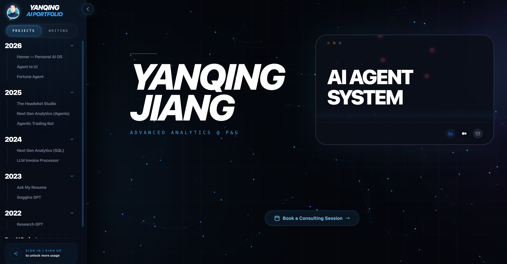
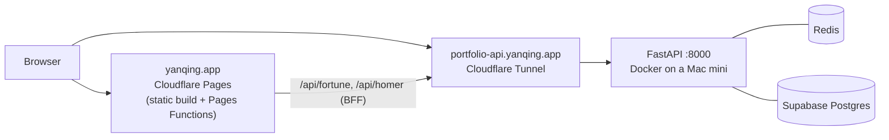

<h1 align="center">AI Portfolio</h1>

<p align="center"><b>The source of <a href="https://yanqing.app">yanqing.app</a>.</b><br>
Yanqing Jiang's portfolio: prerendered project case studies built with React and Vite,<br>
plus a FastAPI backend that runs the live AI demos.</p>

<p align="center">
<a href="https://yanqing.app"><b>Visit the live site</b></a> ·
<a href="ARCHITECTURE.md"><b>Read the architecture</b></a> ·
<a href="#run-it-locally">Run it locally</a> ·
<a href="content/blog/README.md">Write a blog post</a>
</p>

<p align="center"></p>

---

## What is here

Most portfolio entries are case studies. You read the write-up, then ask questions about the project in a shared Gemini chat. A few entries are live experiences with their own frontend and backend:

| Experience | Route | Backend | What it does |
|---|---|---|---|
| Conversational Analytics | `/project/next-gen-analytics-agent` | `/api/conv-analytics` | Claude-driven financial analysis with SQL, charts, clarifying questions and streamed (SSE) progress |
| Agent to UI | `/project/agent-to-ui` | `/api/dash` | Generative dashboards rendered from A2UI messages |
| Fortune Agent | `/project/fortune-agent` | `/api/fortune` | Streamed BaZi readings with replayable snapshots, corrections, follow-up actions and an Ask flow |
| Headshot Studio (LinkedIn Photo) | `/project/linkedin-photo` | `/api/headshot-studio` | Validates an uploaded photo, expands a style prompt, and edits the image with Gemini |
| Homer | `/homer` | `/api/homer/memory-search`, `/api/homer/play` | Case study for [Homer](https://github.com/Yanqing-Jiang/homer), with memory search over a static public corpus and a playable architecture demo |
| Project chat | `/project/:projectId` | `/api/gemini/chat/*` | Gemini Q&A about any portfolio entry |

The site also serves `/consult` (consulting booking with calendar slots and Stripe checkout), `/blog` (self-hosted MDX), `/supreme-metric`, and the static SMS consent pages under [`public/sms/`](public/sms).

Research GPT and Ask My Resume remain as historical case studies. Their dedicated agents were retired in June 2026 along with the old analytics workflow, and they now use the shared project chat. The `next-gen-analytics-agent` slug opens the canonical Conversational Analytics UI.

## How it fits together


```mermaid
flowchart LR
  B[Browser] --> P["yanqing.app<br/>Cloudflare Pages<br/>(static build + Pages Functions)"]
  B --> T["portfolio-api.yanqing.app<br/>Cloudflare Tunnel"]
  P -->|"/api/fortune, /api/homer (BFF)"| T
  T --> F["FastAPI :8000<br/>Docker on a Mac mini"]
  F --- R[(Redis)]
  F --- S[(Supabase Postgres)]
```

The frontend is a prerendered Vite app. Interactive pages call FastAPI over JSON or Server-Sent Events. The Pages Functions in [`functions/`](functions) forward Fortune and Homer requests, adding a request ID and the client IP. Redis holds rate limits and short-lived shared state. Supabase holds bookings, Fortune snapshots, analytics sessions and auth. Component boundaries and request flows are covered in [`ARCHITECTURE.md`](ARCHITECTURE.md).

| Path | Contents |
|---|---|
| [`App.tsx`](App.tsx) | Router and application shell |
| [`components/`](components) | Feature UIs: `conversationalAnalytics/`, `generativeUiDashboard/`, `linkedinPhoto/`, `consulting/`, `homer-lite/`, `Chat.tsx` |
| [`constants.ts`](constants.ts), [`constants/`](constants) | Project catalog, SEO and structured data |
| [`backend/main.py`](backend/main.py) | FastAPI app: health, Gemini chat, TTS, payments, booking, intake, and feature routers |
| [`backend/`](backend) | `conversational_analytics/`, `generative_ui/`, `fortune/`, `linkedin_photo/`, `homer_memory/`, `homer_play/`, `migrations/` |
| [`ssr/`](ssr), [`scripts/prerender.mjs`](scripts/prerender.mjs) | SSR entry and static route generation |
| [`content/blog/`](content/blog) | MDX posts. See the [authoring guide](content/blog/README.md) |

## Run it locally

You need Node.js 20+ (the version CI uses) and Python 3.12 (the version in the backend image). The backend defaults to Redis at `redis://localhost:6379/0`. Basic pages can be explored without it, but creating Fortune runs requires a working Redis connection.

**Frontend.** `services/auth.ts` throws on load if the Supabase variables are missing, so set them before starting the app:

```bash
npm install
cat > .env.local <<'EOF'
VITE_SUPABASE_URL=...
VITE_SUPABASE_ANON_KEY=...
VITE_BACKEND_URL=http://localhost:8000
EOF
npm run dev
```

**Backend.** Put server-side keys in `backend/.env`, which the application loads explicitly:

```bash
python3 -m venv backend/.venv
backend/.venv/bin/pip install -r backend/requirements.txt
backend/.venv/bin/uvicorn main:app --app-dir backend --reload --port 8000
curl http://localhost:8000/health
```

Feature routers are mounted inside `try/except ImportError`, and the startup log shows which ones loaded. Each feature reads its own keys:

| Variable | Used by |
|---|---|
| `CLAUDE_API_KEY` | Required by Conversational Analytics |
| `CLAUDE_API_KEY` (or `ANTHROPIC_API_KEY`) | Agent to UI and intake |
| `DATABASE_URL` | Conversational Analytics financial data |
| `GEMINI_API_KEY` | Project chat, Headshot Studio, Homer play |
| `OPENAI_API_KEY`, `FORTUNE_OPENAI_API_KEY` | Fortune Agent |
| `SUPABASE_DB_URL`, `SUPABASE_JWT_SECRET` | Durable storage, migrations, auth |
| `REDIS_URL` | Rate limits, Fortune events and state, dashboard swap state |
| `STRIPE_*`, `PAYPAL_*`, `GOOGLE_CALENDAR_ID`, `GMAIL_*` | Payments and booking |
| `HOMER_PUBLIC_BRIDGE_URL`, `HOMER_PUBLIC_BRIDGE_SECRET`, `HOMER_PLAY_IP_SECRET` | Homer play (see [`backend/.env.example`](backend/.env.example)) |

Keep secrets in untracked env files (`.env`, `backend/.env` and `backend/.env.production` are git-ignored).

The live demos depend on the author's data and services. Conversational Analytics expects a Postgres database with the financial tables it queries. Homer play forwards to a bridge on the Homer host. Booking uses the author's calendar, Gmail and payment accounts. Without equivalents, those pages load but cannot complete a real run.

## Verify

```bash
npm run test                                      # Vitest
npx tsc --noEmit
npm run build                                     # client bundle, SSR bundle, prerendered pages, sitemaps, feeds
backend/.venv/bin/python -m pytest backend/tests
backend/.venv/bin/python -m compileall -q backend scripts
```

## Deployment

The frontend deploys to Cloudflare Pages through [`.github/workflows/deploy.yml`](.github/workflows/deploy.yml), which runs the tests and the build first.

The backend and Redis run under Docker Compose on the author's Mac mini, and Cloudflare Tunnel exposes the backend at `https://portfolio-api.yanqing.app`:

```bash
docker compose up -d --build
docker compose logs -f backend
curl https://portfolio-api.yanqing.app/health
```

[`docker-compose.yml`](docker-compose.yml) is specific to that host. It reads `backend/.env.production`, mounts a Gmail credential directory from an absolute local path, publishes the backend on host port `8100`, and reaches the Homer bridge through `host.docker.internal:3012`. Adjust those settings before using it elsewhere. On start, the container applies the SQL migrations in [`backend/migrations/`](backend/migrations); this step requires `SUPABASE_DB_URL`. It then runs one gunicorn worker. Redis stores Fortune run state, while active publisher tasks remain owned by the worker that started them.

## License

No license file is checked in.
