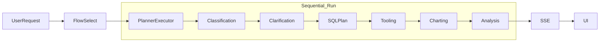
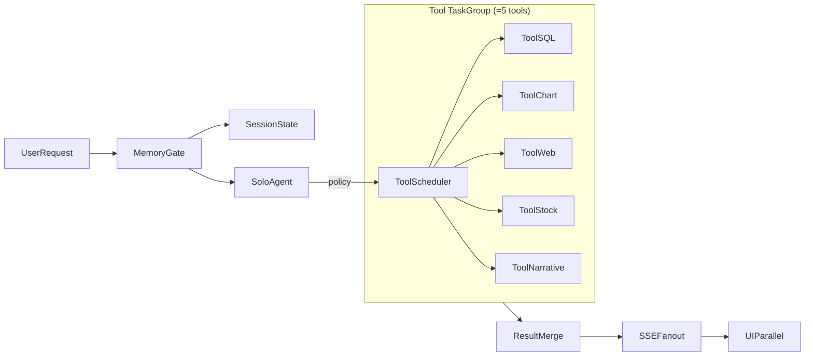
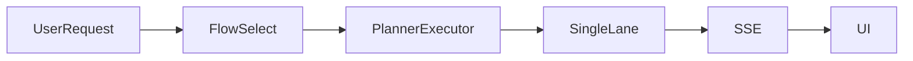
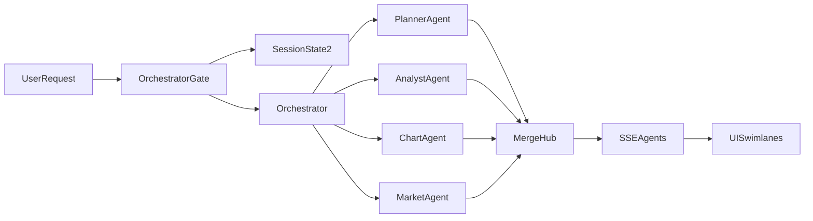

# Analytics Async & Parallel Execution Design Plan (September 29, 2025)

## Context
- `PlannerExecutorFlow.events` currently drives the analytics memory flow as a single coroutine, so classification -> clarification -> SQL/tooling -> charting -> analysis execute serially and emit a one-lane SSE stream that the frontend renders in strict order.
- Parallel execution would race existing hook state because `useAnalyticsMemoryStream`, `ProcessPanel`, and `WorkflowCanvas` assume monotonic step ordering and a single active timeline.
- We want to introduce scoped concurrency without rewriting the whole stack, keep the UX legible, and leave a kill switch that returns to today's deterministic path.

### Current Sequential Flow (Before)

## Mode 1: Single Agent + Tool Fan-Out (=5 tools)
### Goals
- Retain the "one pilot" mental model while overlapping independent tool calls to cut latency and surface richer telemetry.
- Curate five adapters-SQL planner/executor, chart builder, Responses API web retriever, stock price tracker, and narrative synthesizer-to keep the catalog focused while mirroring Claude Code's limited-but-powerful roster and Claude Sonnet 4.5's tooling guidance without overwhelming operators.[4][5][20][25][23]

### Proposed Architecture (After)

#### Memory gate & session state internals
- **MemoryGate**: lightweight policy that inspects the active transcript, embedding summaries, and latest tool receipts before dispatching; it chooses whether to replay cached artifacts, warm the agent with short summaries, or trigger a cold-start run so we skip redundant work while keeping state bounded.[16][17][21]
- **SessionState (Redis)**: conversation-scoped record (chart specs, SQL plans, tool payloads, guardrail flags) stored in our existing Redis cluster with a short per-session TTL (target 5 minutes, configurable 1-15) and automatic eviction when a chat ends; the gate reads/writes via async repositories and logs deltas to our internal analytics event store for debugging.[16][26]
- **SoloAgent**: the primary planner/executor that consumes gated context plus the live user turn, then schedules up to five adapters with latency budgets and cancellation hooks emitted by the gate.

**Behind-the-scenes flow**
1. MemoryGate pulls the latest Redis session snapshot (falling back to a cold template if TTL expired) and scores intent similarity to prior turns.
2. Policy rules decide whether to reuse prior SQL/chart assets, hydrate SoloAgent with condensed summaries, or fan-out fresh tool work; decisions and rationale get written to the internal analytics event store for debugging.[21]
3. SoloAgent emits a task plan to `ToolScheduler`, which spins up TaskGroup workers constrained by shared semaphores so Redis state stays consistent even under bursty workloads.[1][2][3]
4. First-run policy automatically enqueues the Responses API Web Retriever so we start with fresh external context; MemoryGate then suppresses the retriever on follow-up requests that only revise prior outputs (for example, chart tweaks) unless intent scoring flags stale data.[25]

### Backend changes
- Slice `PlannerExecutorFlow.events` into phase coroutines and run tool adapters inside an `asyncio.TaskGroup` so we get structured cancellation and natural fan-in.[1]
- Guard external resources (Supabase, HTTP clients, thread pools) with shared `asyncio.Semaphore` instances to prevent tool bursts from overrunning I/O capacity.[2][3]
- Create `ToolTaskGroup` in `backend/analytics/flows/tooling.py` to register the five adapters, pair each with latency budgets, and emit per-tool telemetry fields.
- Align tool behaviors with Anthropic's Claude Code guidance (clear sandbox boundaries, deterministic command set) and add optional "computer use" automation for rich demos when infra allows.[4][5]
- Stream per-tool reasoning and outputs into the internal analytics event store so support teams can replay the entire solo-agent run with timeline context.

#### Tool adapter roster (draft)
### Result composition and delivery
- `ResultMerge` aligns tool outputs by `stepId`, timestamp, and correlation IDs so charts, narrative bullets, stock views, and web snippets land in a single SSE frame.
- The serializer tags each fragment with its producing adapter and injects concise summaries so the UI can stack analysis, charts, stock visuals, and web callouts without overwhelming the user, following multi-surface agent UX patterns showcased in Microsoft 365 multi-agent demos.[11][20]
- Stock data arrives as both the TradingView widget configuration and normalized series, letting the same pipeline drive the visual embed and the narrative recap.[23][24]

1. **SQL Planner/Executor** - generates validated SQL, executes against warehouse connectors, and hands structured frames to downstream adapters; keeps planner+executor paired so charting receives ready-to-visualize data.[1]
2. **Chart Builder** - renders chart specs (Vega-Lite/ECharts) from result frames and applies theme presets so the UI can hydrate visuals with minimal transforms.[7][18]
3. **Responses API Web Retriever** - leverages OpenAI's built-in web search tool to pull the freshest supporting context when internal data trails public news, replacing the legacy doc retriever.[25]
4. **Stock Price Tracker** - embeds a plug-and-play TradingView widget that renders recent price movements for requested tickers without custom chart code, while exposing normalized series back to SoloAgent for reasoning.[23][24]
5. **Narrative Synthesizer** - consolidates SQL + web findings into analyst-ready bullet points that SoloAgent can surface as tool reasoning or final response seeds, following orchestration patterns from recent enterprise agent rollouts.[11]

### Frontend & visualization
- Extend `useAnalyticsMemoryStream` to bucket events by `(stepId, tool_group, concurrency_slot)` and render stacked tool cards, following Agent Collaboration and transparency patterns for readable multi-track reasoning.[7][18]
- Add inline context-recall chips (e.g., "Reused dataset from 12:32 PM run") and editing affordances in `ProcessPanel` and `WorkflowCanvas`, borrowing from memory-aware UX patterns.[8]
- Persist merged traces so users can expand a tool tile to see the underlying reasoning snippet and status badge (success, partial, cancelled).

### Operational considerations
- Ship behind `ANALYTICS_TOOL_PARALLELISM` with staged rollouts (staging: max two concurrent tools, production: up to five once infra metrics stay green).
- Enrich SSE payloads with `tool_group` IDs, `sequence_index`, and heartbeat envelopes to keep reconnections safe and align with SSE best practices.[9][10]
- Provide a feature flag that reverts to the sequential executor if we detect latency regressions or downstream throttling.
- Instrument agent + tool telemetry (latency, retries, fallbacks) following multi-agent release checklists so ops teams can catch regressions before they impact users.[22]
- Defer automated guardrails for launch; instead pair internal event logs with manual sampling and revisit safety automation once telemetry stabilizes.

### Alternatives & rollout guardrails
- Even without parallelism enabled, the refactor delivers value by isolating phases and capturing richer telemetry for slower tools.
- If external APIs impose request-per-second quotas, swap semaphores for a rate-limited queue without touching the agent policy layer.

## Mode 2: Multi-Agent Orchestration (<5 agents)
### Goals
- Demonstrate orchestrated collaboration across planner, analyst, chart specialist, and market intelligence roles while keeping the graph small (three specialists + conductor) for clarity and cost control.[11][12]
- Produce concrete artifacts-analysis narrative, chart spec, validated SQL-and visualize which agent contributed each artifact.

### Current Orchestration Gap (Before)

### Proposed Architecture (After)

### Backend changes
- Introduce `AgentExecutionOrchestrator` that consumes a shallow DAG (max depth 3) and fans out independent phases via `TaskGroup`, aligning with modern orchestrator-worker patterns.[1][11]
- Update `MultiAgentFlow` to register four specialized agents (Planner, Analyst, Chart, Market), inspired by Microsoft Copilot Studio's connected-agent model and IBM watsonx orchestration, including capability metadata and evaluator hooks.[11][12]
- Borrow cancellation/evaluation tactics from recent multi-agent research (DynTaskMAS dynamic task graphs, Neural Orchestration agent selection) to short-circuit low-confidence outputs and keep agent counts low.[13][14]
- Incorporate knowledge-base-aware heuristics so the orchestrator can surface relevant prior artifacts before dispatching agents, keeping the graph compact without sacrificing context reuse.[21]
- Reuse the shared Stock Price Tracker adapter for the Market agent so we avoid duplicating data providers while still emitting dedicated market context updates.[23][24]
- Emit SSE events with `parallel_group`, `agent_role`, and parent IDs so the UI can reconstruct swimlanes and juggled tasks.

### Frontend & visualization
- Render agent swimlanes with progressive disclosure of reasoning snippets, applying Agent Collaboration and agentic visualization patterns to keep hand-offs transparent.[7][18]
- Color-code lanes per agent role, display confidence chips, and expose replay links into our internal analytics viewer for post-mortems.
- Highlight context reuse (e.g., "Planner referenced prior SQL plan") using the same memory-aware cues introduced in Mode 1.[8]

### Operational considerations
- Default orchestrator to deterministic seeds and explicit timeouts; allow stochastic sampling only behind a developer toggle for experimentation.
- Gate expensive branches (e.g., market data refreshes) on policy scores and runbooks informed by Microsoft's Agent Factory guidance so we scale safely.[19]
- Persist agent decisions so aborted runs can be resumed without recomputing upstream steps.
- Instrument agent orchestration metrics (handoff count, retries, evaluation scores) per industry guidance so we can debug cross-agent flows quickly.[22]
- Keep guardrails manual for v1; rely on Market agent telemetry and our internal event logs to flag anomalies before adding automated intervention logic.

### Alternatives & rollout guardrails
- If multi-agent latency is unacceptable, downgrade to the single-agent fan-out path while keeping the orchestrator API for future experiments.
- Consider integrating LangGraph's parallel edges in a later phase for more complex DAGs once we validate the lightweight orchestrator.[15]

## Adaptive Agent & Tool Selection
- Introduce a session-level "policy context" that inspects prior turns and chooses between solo-agent fan-out, multi-agent orchestration, or a minimal single-tool replay; persist the decision payload in Redis alongside the conversation key with the same short TTL (target 5 minutes, configurable 1-15) so repeats within the window reuse the routing.[16][17][26]
- Store conversational memory and derived state in a structured buffer (LangChain-style conversation memory + summaries) so agents can detect requests like "change the previous chart to a bar chart" and reuse prior outputs without full regeneration, then feed that state into orchestrator heuristics similar to knowledge-base-aware approaches like Kairos.[16][17][21]
- Surface the policy decision to users via a discreet banner ("Reusing single-agent workflow from 08:14 PM because you referenced prior chart") to reinforce trust and control while keeping the UI legible.[8]
- Expire the Redis session immediately when a chat ends (or on idle timeout) so no cross-session memory persists, aligning with the ephemeral requirement while still enabling adaptive routing within a live conversation.[26]
## Targeted code changes & benefits
- `backend/analytics/flows/planner_executor.py`: break monolithic coroutine into phase coroutines, insert `TaskGroup` scheduling hooks, and emit enriched telemetry (enables structured concurrency and fan-in).[1]
- `backend/analytics/flows/tooling.py`: new module hosting `ToolTaskGroup`, shared semaphores, and adapter registry (centralizes =5 tools and resource guards).[3][4]
- `backend/analytics/flows/multi_agent.py`: wire up `AgentExecutionOrchestrator`, enforce =4 worker agents, and define evaluator callbacks (keeps orchestration bounded and observable).[11][14]
- `backend/analytics/core/events.py`: add helpers for `fanout_progress`/`fanout_result` events with heartbeat support and deterministic ordering fields (stabilizes SSE replay).[9][10]
- Frontend (`useAnalyticsMemoryStream.ts`, `ProcessPanel.tsx`, `WorkflowCanvas.tsx`): support parallel group keys, swimlane rendering, and context recall indicators (visualizes concurrency without confusing users).[7][8][18]

## Risks & mitigations
- **Resource saturation**: semaphore-guard all adapters, start with conservative concurrency caps, and monitor queue depth to decide if we need dedicated rate limiting.[2][3]
- **UX overload**: apply agent collaboration and transparency patterns so concurrent tracks remain readable; provide a "collapse to sequential view" toggle.[7][18]
- **Debuggability gaps**: require internal event logging for every run and expose run IDs in the UI for quick drilldowns.
- **SSE fragility**: include heartbeats, sequence IDs, and sentinel events so reconnects resume cleanly and avoid duplicate renders.[9][10]

## Validation plan
- Add pytest suites under `backend/tests/analytics/` that simulate concurrent tool execution and multi-agent DAGs with fake async tasks, asserting ordering, cancellation, and merge semantics.[1][13]
- Expand frontend unit tests (Vitest) for `useAnalyticsMemoryStream` to cover mixed `tool_group`/`parallel_group` payloads, plus snapshot tests for swimlane rendering.
- Add Playwright smoke tests that verify swimlane visuals, tool stacks, and memory-aware banners using recorded SSE fixtures.
- Schedule load tests (Locust or k6) comparing sequential, tool fan-out, and agent fan-out latency; target =20% latency improvement for tool-heavy runs when parallelism is enabled.[13]

## References
1. Python Software Foundation. "Coroutines and Tasks - Python 3.11.13 Documentation." https://docs.python.org/3.11/library/asyncio-task.html (accessed Sep 29, 2025).
2. FastAPI Documentation. "Concurrency and async / await." https://fastapi.tiangolo.com/async/ (accessed Sep 29, 2025).
3. Python Software Foundation. "Synchronization Primitives - Python 3.11.13 Documentation." https://docs.python.org/3.11/library/asyncio-sync.html (accessed Sep 29, 2025).
4. Anthropic. "Claude Code overview." https://docs.anthropic.com/en/docs/agents-and-tools/claude-code/overview (accessed Sep 29, 2025).
5. Anthropic. "Computer use tool." https://docs.anthropic.com/en/docs/agents-and-tools/tool-use/computer-use-tool (accessed Sep 29, 2025).
6. LangChain. "Annotate code for tracing." https://docs.smith.langchain.com/how_to_guides/tracing/annotate_code (accessed Sep 29, 2025).
7. Agentic Design. "Agent Collaboration UX." https://agentic-design.ai/patterns/ui-ux-patterns/agent-collaboration-ux (accessed Sep 29, 2025).
8. VSDesign. "7 UX Patterns for Designing Trustworthy AI Agents." https://vsdsgn.com/news/7-ux-patterns-for-designing-trustworthy-ai-agents (accessed Sep 29, 2025).
9. Speakeasy. "Server-sent events in OpenAPI: Best Practices." https://www.speakeasy.com/openapi/content/server-sent-events (accessed Sep 29, 2025).
10. MDN Web Docs. "Using server-sent events." https://developer.mozilla.org/en-US/docs/Web/API/Server-sent_events/Using_server-sent_events (accessed Sep 29, 2025).
11. Microsoft. "Introducing Microsoft 365 Copilot Tuning, multi-agent orchestration, and more from Microsoft Build 2025." https://www.microsoft.com/en-us/microsoft-365/blog/2025/05/19/introducing-microsoft-365-copilot-tuning-multi-agent-orchestration-and-more-from-microsoft-build-2025/ (accessed Sep 29, 2025).
12. IBM. "Multi-agent orchestration." https://www.ibm.com/products/watsonx-orchestrate/orchestrator-agent (accessed Sep 29, 2025).
13. Junwei Yu, Yepeng Ding, Hiroyuki Sato. "DynTaskMAS: A Dynamic Task Graph-driven Framework for Asynchronous and Parallel LLM-based Multi-Agent Systems." arXiv:2503.07675 (Mar 10, 2025).
14. Kushagra Agrawal, Nisharg Nargund. "Neural Orchestration for Multi-Agent Systems." arXiv:2505.02861 (May 3, 2025).
15. Amit Kumar Jaiswal. "Parallel workflows in LangGraph - A Practical Approach." https://medium.com/@ameejais0999/parallel-workflows-in-langgraph-a-practical-approach-6e4340ceb8d4 (Jul 2025).
16. LangChain. "Conversation Buffer Memory." https://python.langchain.com/v0.1/docs/modules/memory/types/buffer/ (accessed Sep 29, 2025).
17. GeeksforGeeks. "Memory in LangChain." https://www.geeksforgeeks.org/artificial-intelligence/memory-in-langchain-1/ (accessed Sep 29, 2025).
18. Vaishali Dhanoa et al. "Agentic Visualization: Extracting Agent-based Design Patterns from Visualization Systems." arXiv:2505.19101 (May 25, 2025).
19. Business Insider. "Internal Microsoft memo reveals plans for a new "Tenant Copilot' and an "Agent Factory' concept." https://www.businessinsider.com/microsoft-tenant-copilot-ai-agent-factory-2025-5 (May 16, 2025).
20. Emma Roth. "Anthropic's new Claude Sonnet 4.5 adds features for developers." The Verge. July 10, 2025. https://www.theverge.com/2025/7/10/claude-sonnet-4-5-developer-features-tools
21. IBM Research. "Kairos: Knowledge-Base-Aware Multi-Agent Orchestration." IBM Research Blog. July 2, 2025. https://research.ibm.com/blog/kairos-knowledge-base-aware-multi-agent-orchestration
22. Christina Hsiao. "Taking Multi-Agent AI from Hype to Reality." SixFin Blog. June 9, 2025. https://sixfin.com/articles/multi-agent-ai-hype-reality

23. TradingView. "Lightweight Charts v5 Documentation." https://www.tradingview.com/lightweight-charts/ (accessed Sep 29, 2025).
24. TradingView. "Symbol Overview Widget." https://www.tradingview.com/widget/advanced-chart/ (accessed Sep 29, 2025).
25. OpenAI. "Use web search with the Responses API." https://openai.com/index/use-web-search-with-the-responses-api/ (accessed Sep 29, 2025).
26. Redis. "Build generative AI session state with Redis." https://redis.com/blog/build-real-time-personalization-and-llm-session-state/ (accessed Sep 29, 2025).
