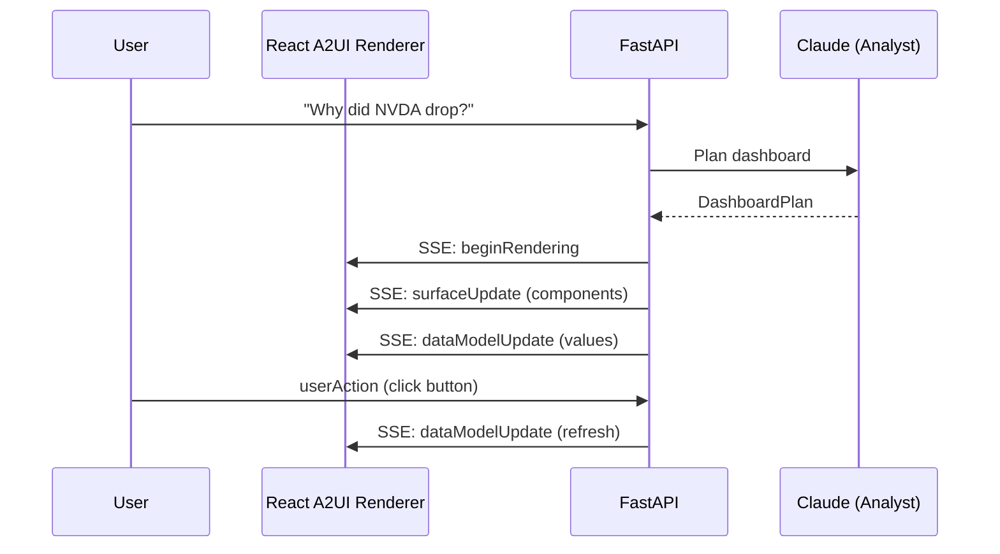

# Generative UI - A2UI Dashboard (2026 Project)

A financial dashboard system built on the **A2UI v0.8** protocol for agent-driven, generative UI.

## Overview

This project implements the [A2UI (Agent-to-User Interface)](https://a2ui.org/) protocol to create dynamic, AI-generated dashboards for financial analysis. The key innovation is separating **what** to show (agent decision) from **how** it's rendered (trusted client components).

```
User Question → Claude (Planning) → A2UI Messages → React Renderer → Dashboard
```

## Architecture

### A2UI Protocol Flow



### Key A2UI Concepts

| Concept | Description |
|---------|-------------|
| **Surface** | A renderable UI tree with unique component IDs |
| **surfaceUpdate** | Adds/updates components in the tree |
| **dataModelUpdate** | Updates data values (prices, KPIs, etc.) |
| **BoundValue** | Links component props to data model paths |
| **userAction** | Client → Server message when user interacts |
| **Catalog** | Contract defining available components |

## Project Structure

```
backend/generative_ui/
├── __init__.py
├── config.py                     # Settings
├── a2ui/                         # A2UI Protocol
│   ├── messages.py               # Pydantic models
│   ├── generator.py              # Plan → A2UI stream
│   └── catalog.py                # Financial catalog
├── models/
│   ├── dashboard_plan.py         # Claude output model
│   └── dashboard_state.py        # Runtime state
└── routes/
    └── dashboard.py              # API endpoints

components/generativeUiDashboard/
├── index.ts                      # Module exports
├── a2ui/                         # A2UI Protocol Layer
│   ├── types.ts                  # TypeScript types
│   ├── MessageProcessor.ts       # State management
│   ├── DataBinder.ts             # Resolve BoundValue
│   └── useA2UIStream.ts          # React hook
├── renderer/
│   ├── A2UISurface.tsx           # Root renderer
│   ├── ComponentRenderer.tsx     # Recursive render
│   └── Registry.tsx              # Type → Component
├── standard/                     # Standard A2UI
│   ├── Text.tsx, Row.tsx, Column.tsx, Card.tsx, Button.tsx
└── widgets/                      # Custom Financial
    ├── PriceChart.tsx            # TradingView
    ├── KpiCard.tsx
    ├── DataTable.tsx
    ├── NewsTimeline.tsx
    └── CorrelationMatrix.tsx     # ECharts
```

## API Endpoints

| Endpoint | Method | Description |
|----------|--------|-------------|
| `/api/dash/create` | POST | Create dashboard from question |
| `/api/dash/{id}/stream` | GET | SSE stream of A2UI messages |
| `/api/dash/{id}/spec` | GET | Get dashboard specification |
| `/api/dash/{id}/data` | GET | Get latest data |
| `/api/dash/{id}/action` | POST | Handle user action |
| `/api/dash/{id}` | DELETE | Delete dashboard |

## Usage

### Backend

```python
from generative_ui.a2ui import A2UIMessageGenerator
from generative_ui.models import DashboardPlan

# Create generator
gen = A2UIMessageGenerator("dashboard_123")

# Generate from plan
for msg in gen.generate_from_plan(plan):
    yield f"data: {msg}\n\n"

# Update data
data_msg = gen.update_price_data(price=134.25, volume=89000000, change=-5.2, change_percent=-3.8)
```

### Frontend

```tsx
import { DashboardViewer } from '@/components/generativeUiDashboard';

function App() {
  return (
    <DashboardViewer 
      dashboardId="abc123" 
      apiBaseUrl="/api/dash"
    />
  );
}
```

### Using the Hook

```tsx
import { useA2UIStream, useSurface, A2UISurface } from '@/components/generativeUiDashboard';

function Dashboard({ dashboardId }) {
  const url = `/api/dash/${dashboardId}/stream`;
  const [state, actions] = useA2UIStream(url, { dashboardId });
  const { surface, dataModel } = useSurface(state, 'dashboard_main');

  const handleAction = (name, context) => {
    actions.sendAction({ name, surfaceId: 'dashboard_main', context });
  };

  return (
    <A2UISurface 
      surface={surface} 
      dataModel={dataModel} 
      onAction={handleAction} 
    />
  );
}
```

## Custom Components

To add a custom widget:

1. **Define in catalog** (`backend/generative_ui/a2ui/catalog.py`):
```python
"MyWidget": ComponentDefinition(
    description="...",
    properties={
        "data": ComponentProperty(type="BoundArray", required=True),
    }
)
```

2. **Create React component** (`components/generativeUiDashboard/renderer/widgets/MyWidget.tsx`):
```tsx
export function MyWidget({ props, dataModel }: A2UIRendererProps) {
  const data = resolveArray(props.data, dataModel, []);
  return <div>{/* render */}</div>;
}
```

3. **Register in Registry** (`renderer/Registry.tsx`):
```tsx
import { MyWidget } from './widgets/MyWidget';
componentRegistry['MyWidget'] = MyWidget;
```

## Security

- **No LLM-generated HTML/JS** — Only JSON specifications
- **Catalog enforcement** — Unknown components rejected
- **Strict CSP** — React renders trusted components only
- **Data sanitization** — All bound values validated

## Resources

- [A2UI Specification v0.8](https://a2ui.org/specification/v0.8-a2ui/)
- [A2UI GitHub](https://github.com/google/A2UI)
- [Component Reference](https://a2ui.org/reference/components/)
- [Implementation Plan](../../.gemini/antigravity/brain/ac552fdc-c9c5-47a8-9608-af0ff3b69d74/implementation_plan.md)

## Status

🚧 **Phase 1: Core Infrastructure** — Complete  
⬜ Phase 2: Standard Components  
⬜ Phase 3: Financial Widgets  
⬜ Phase 4: Claude Integration  
⬜ Phase 5: Polish & Export
