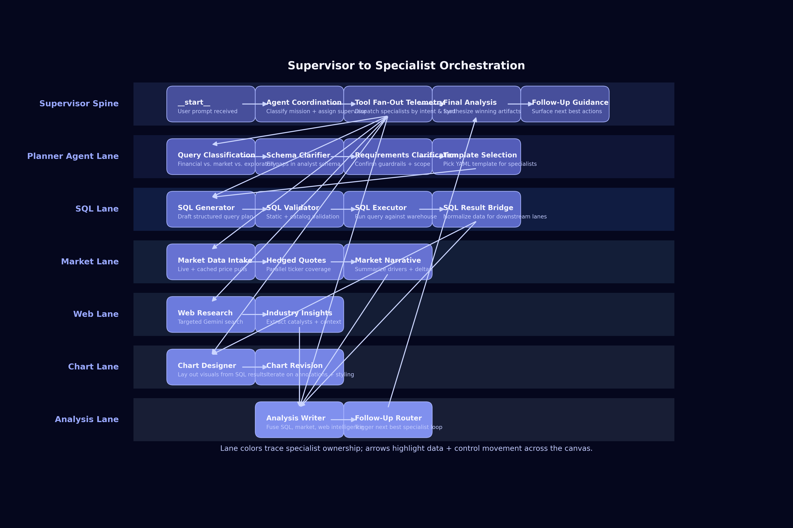

# Analytics Agent Thinking Canvases

This note captures the analytics thinking panel visualization as of October 26, 2025. It explains how the single-agent and multi-agent canvases are currently rendered, the ledger metadata that drives placement, and the next steps for tightening the layouts.

## What Changed

- **Shared start spine** -- every run now begins with the canonical `fanout_start` (`__start__`) glyph, feeding either the single-agent hub or the multi-agent supervisor row.
- **Lane-aware stacking** -- node placement keys off `(lane, parallelGroup)`, so work that belongs in the same logical lane stays aligned even when multiple tools run concurrently.
- **Intent gating cluster** -- the planner ribbon (`classification + intent_detection + clarification + schema_validation`) remains a straight bridge between `_start_` and the hub.
- **Horizontal swim lanes** -- the single-agent canvas now renders planner, SQL, market, web, chart, and analysis as horizontal bands. The hub sits above them and drops vertical connectors into each lane.
- **Inline SQL timeline** -- SQL tools continue to run sequentially, but their nodes advance left-to-right inside the SQL lane, giving a horizontal timeline once the hub fans downward.
- **Fan-out telemetry surfaced** -- `tool_fanout` still exposes winning branches, hedged work keeps dashed purple edges, and cached steps retain the golden dashed treatment across both canvases.
- **Supervisor swimlane diagram refreshed (Oct 26, 2025)** -- the orchestration view now stretches horizontally and vertically so the supervisor spine and every specialist lane remain legible during fan-out.

## Supervisor Swimlane Diagram (Oct 26, 2025)



The refreshed panel widens the supervisor spine and spaces each specialist band with a consistent height so data hand-offs never overlap. Vertical connectors drop cleanly from **Tool Fan-Out Telemetry** into the planner, SQL, market, web, chart, and analysis lanes, and the wider canvas keeps the node cards readable even when every lane activates.

Within each lane the execution order now reads explicitly left-to-right; for example, the SQL band highlights `SQL Generator -> SQL Validator -> SQL Executor -> SQL Result Bridge`, while market and web lanes stage their own sequential tracks. The analysis lane collects vertical feeds from every specialist and routes results back to the supervisor spine, making the distribution and reconciliation loop obvious at a glance.

## Single-Agent Canvas

### Pre-Fan-Out Preparation

- `_start_` connects to the pre-processing ribbon (`classification`, `intent_detection`, `clarification_manager`, `schema_validation`, `plan_and_select_template`) before reaching `tool_fanout`.
- The ribbon keeps a single straight edge into the hub so operators can verify that intent gating completed without scanning the swim lanes.
- Header fan-out counters remain hidden until `tool_fanout` transitions out of `pending` or `queued`, matching the behaviour in `ProcessPanel`.

### Swim-Lane Fan-Out

- **Vertical connectors** -- `tool_fanout` sits on a hub row above the lanes. When a specialist activates, the hub emits a vertical edge into that lane and the lane renders the steps from left-to-right or top-to-bottom depending on its rules.
- **SQL lane** -- once the hub lands in the SQL band, the lane stages (`sql_generator`, `sql_validator`, `sql_executor`, `sql_result_bridge`, plus legacy `sql_compilation`/`sql_validation`/`sql_execution`) line up left-to-right. Any retries stack slightly below the main sequence but stay inside the band.
- **Market lane** -- `market_question_a`, `market_question_b`, `stock_tracker`, and other price fetches occupy their own band. Multiple tools are stacked vertically inside the lane so the swim lane still reads left-to-right.
- **Web lane** -- cached and live Gemini searches occupy the web band. Parallel searches stack vertically beneath the hub connector.
- **Chart lane** -- `chart_designer` and chart revisions appear on a horizontal track aligned with the chart band. Inputs from SQL rise vertically into this band.
- **Analysis lane** -- `analysis_writer`, `analysis_generation`, and `follow_up_route` collect outputs from every upstream lane through vertical merge edges.

### SQL Lane Sequencing Plan

- **Horizontal timeline** -- the canonical order stays `sql_generator -> sql_validator -> sql_executor -> sql_result_bridge`. All four nodes share `lane: "sql"` and `parallelGroup: "sql_spine"` so they render as a single horizontal strip.
- **Intent bridge** -- planner ribbon nodes still emit a vertical edge into `sql_generator` once validation resolves, highlighting the dependency without collapsing lane separation.
- **Chart dependency** -- `chart_designer` subscribes to `sql_executor`; the edge climbs vertically from the SQL band into the chart band before moving horizontally.
- **Analysis merge** -- `sql_result_bridge` produces the artifact edge into `analysis_writer`, while market and web bands contribute their own vertical edges to the analysis band.
- **Example ledger entries** -- configure step metadata to enforce ordering:

```json
[
  {
    "id": "sql_generator",
    "display_name": "SQL Generator",
    "lane": "sql",
    "parallelGroup": "sql_spine",
    "sequence": 1
  },
  {
    "id": "sql_validator",
    "display_name": "SQL Validator",
    "lane": "sql",
    "parallelGroup": "sql_spine",
    "sequence": 2,
    "depends_on": ["sql_generator"]
  },
  {
    "id": "sql_executor",
    "display_name": "SQL Executor",
    "lane": "sql",
    "parallelGroup": "sql_spine",
    "sequence": 3,
    "depends_on": ["sql_validator"]
  },
  {
    "id": "sql_result_bridge",
    "display_name": "SQL Result Bridge",
    "lane": "sql",
    "parallelGroup": "sql_spine",
    "sequence": 4,
    "depends_on": ["sql_executor"],
    "feeds": ["analysis_writer", "chart_designer"]
  }
]
```

### Final Diagram Pattern

- Planner lane: `classification -> intent_detection -> clarification_manager -> schema_validation -> plan_and_select_template` remains a single horizontal ribbon feeding the hub.
- Hub row: `tool_fanout` sits above the specialist lanes; each activated lane receives a vertical connector and pushes work across its band.
- SQL lane: `SQL Generator -> SQL Validator -> SQL Executor -> SQL Result Bridge` reads left-to-right. Retries stack below the band but stay aligned.
- Market lane: market tools occupy the next band; optional tickers or hedged calls appear as additional cards stacked beneath the main track.
- Web lane: primary and industry research cards sit side-by-side; cached runs stack under the live call.
- Chart lane: `Chart Designer` and revisions stay aligned horizontally, with vertical inbound edges from SQL.
- Analysis lane: `Analysis Writer`, `analysis_generation`, and `follow_up_route` form the final band, ingesting vertical edges from every other lane.
- Telemetry cues: cached steps keep the golden dashed edge and the swim-lane layout makes skipped lanes obvious because they lack a hub connector.

## Multi-Agent Canvas

### Start + Supervisor Spine

- `_start_ -> agent_coordination -> analysis_generation -> follow_up_route` forms the primary supervisor spine.
- The supervisor row sits at the top of the canvas. Light dashed returns indicate coordination messages without overwhelming the lane layout.

### Specialist Lane Columns

- **Column swim lanes** -- planner, SQL, market, web, chart, and analysis each own a full-height vertical column beneath the supervisor row. Steps progress top-to-bottom in their column.
- **Header badges** -- every column header shows the specialist name, active status, and latest artifact so the canvas reads like a mission-control board.
- **Parallel runs** -- when a lane spins up multiple tools, the nodes stagger horizontally within the column while staying anchored to the same top-down order.
- **Coordinator edges** -- vertical connectors drop from `agent_coordination` into the active columns and rise back into `analysis_generation`, differentiating the multi-agent canvas from the single-agent swim lanes.
- **Cache & hedge indicators** -- cached steps keep the golden dashed edge; hedged branches remain purple, hugging the column to avoid cross-lane clutter.

### Telemetry & Edge Semantics

- Solid edges indicate active work; dashed edges mark queued or hedged turns.
- Winning fan-out branches bubble up as node subtitles so it is clear which specialist delivered the decisive artifact.
- Hub-to-lane edges animate only during active work, reducing noise once a lane finishes.

## Remaining Follow-Up

1. Snapshot the grouped-steps ledger (`docs/agent-process-ledger (99).json`) inside Storybook/Jest so swim-lane placement stays regression proof.
2. Add a second fixture without `schema_validation` to confirm the planner ribbon collapses cleanly when the ledger omits that step.
